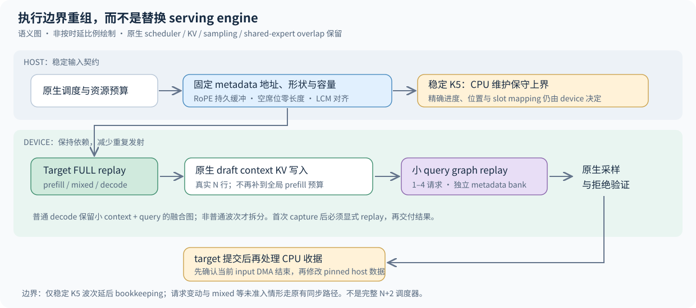
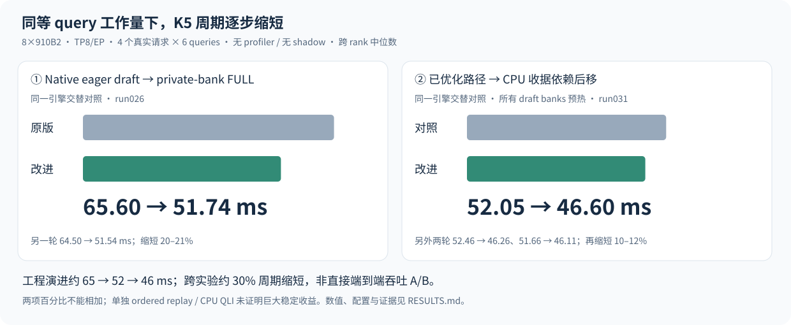

# DSV4 执行路径改造：更完整的 Graph，更短的 K5 周期

**strengthen-dsv4 · 技术汇报 · 2026-09-13**

## 一句话结论

我们保留 vLLM / vLLM-Ascend 的成熟引擎，在它已有的高性能算子之上，
**补齐可捕获的状态契约，把 draft 发射和非必要 CPU 等待从执行关键路径移开。**
在八卡、四请求的同等 K5 query 工作量下，工程演进约为 **65 → 52 → 46ms/波次**。
这是一组分别隔离验证的执行路径改进，不是“重写一个更快引擎”的承诺。

交付物不再只有原型：维护源码在 `src/strengthen_dsv4/`，统一启动入口是
`bin/strengthen-dsv4`；`baseline` 与 `optimized` 使用同一入口、同一组 donor pins。



## 1. 问题不是缺一个快算子，而是快算子之间还有什么

本轮 donor 已经有量化 GEMM、DSACP、shared-expert overlap 和 target decode FULL。
我们没有把这些能力重新实现一遍。剩余问题集中在三个执行边界：

1. **Target prefill/mixed 缺少完整的捕获契约。** 只宣布支持 FULL 不够：临时
   RoPE、变化的 request metadata 形状、失配的容量和空席位，都可能破坏 replay。
2. **DSpark 的一个调用里混着两种规模完全不同的工作。** 大量 target hidden
   rows 要写入 draft context KV；真正生成候选 token 的 query 却很少。把两者一起
   补到大 prefill 桶，会放大工作与显存，也让小 mixed 波次承担多余发射成本。
3. **CPU 收据在 target 提交之前被消费。** 部分 CPU 数据只是 tiling 上界，并不
   决定实际 KV 地址；若仍先等精确收据，就把不必要的 host 等待留在关键路径上。

我们的切入点是**输入形状、状态所有权和完成顺序**，不是改模型算法、换采样器，
也不是假定所有等待都能删掉。

## 2. 补丁怎样起作用

### A. 让 target 的 FULL 支持变成真实契约

- Target metadata 构造期间，RoPE 写入持久缓冲；draft 保留独立缓冲，不互相覆盖。
- Request 容量服从 graph descriptor。请求减少时，重复最后一个真实 query offset，
  将未使用席位表示成零长度，而不是临时增加一个 FIA dummy request。
- 固定捕获所需的 metadata 维度和分配上界；实际访问仍受 device metadata 控制。
- K5 的6与 TP8 的8共同要求 **LCM24** 对齐。修复的是 capture bucket 计算，
  不是改变投机长度。这个启动兼容修复也保留在 baseline 中。

因此 prefill、mixed、decode 可以进入同一 target FULL 路线，而不是仅在图外包一层壳。

### B. 把 draft 的“大输入更新”与“小 query 执行”分开

```text
非普通 decode 波次：
N 行 target hidden → 原生 context KV 写入（恰好 N 行）→ 小 query graph → 原生拒绝验证

普通 K5 decode：
继续复用已有的小 context + query 融合图
```

Query graph 使用每个请求数对应的 private metadata bank；刷新数据但不重绑地址。
其形状不再跟随大 context 长度膨胀。临时屏蔽的仅是 native merged runnable 内部
已经执行过的 context hook，退出和异常都会恢复；没有另写一份 sampling 或 Markov 逻辑。

一个重要正确性细节：**capture 是初始化，不是已提交的服务调用**。首次 capture 后
显式 replay，再向上层交付结果。只检查第二次 replay 会漏掉这个问题。

### C. 保留 device 依赖，移动 CPU 等待

- 已验证的 target replay 使用同一 producer/replay stream 的顺序，不再每次先做
  host replay fence。换 stream、未捕获入口等仍走原路径或拒绝未验证行为。
- QLI 的 tiling maxima 使用现成 CPU mirrors，避免为了取一个上界读回 device。
- 仅在**请求集合和索引稳定、全部是 K5 verification** 的波次，CPU 采用保守长度上界；
  device 的精确进度修正、position 和 slot mapping 不变。
- 先提交 target，再退役当前 input DMA，然后执行原 CPU bookkeeping callback。
  **不能把 device 排序当成 pinned host buffer 可改写的证明。** 这道 DMA ownership
  检查保留了下来。

请求加入、退出、mixed 等不满足准入条件时，保留原同步路径。
这不是完整 N+2 scheduler，也没有提前回收 KV 页。

## 3. 性能结果：明确对谁、在什么配置下更快



共同环境：8×Ascend910B2/HCCS，CANN9.0.1，torch-npu2.10.0.post2；DSV4 Flash W8A8，
TP8+EP、DSACP、K5、最多4个 active requests。性能窗口不带 profiler 或 shadow。

| 改动 | 对照 | 改进 | 解释 |
|---|---|---|---|
| Private-bank draft FULL + ordered replay + CPU QLI | 原生 eager DSpark | 约65 →52ms | 两轮同引擎交替，20–21% 周期缩短 |
| CPU bounds + post-submit receipt | 上一行已优化路径 | 约52 →46ms | 三轮同引擎交替，再缩短10–12% |
| Split context/query：6+17小 mixed | 已优化但未 split 的对照 | 63.96 →46.37ms | 单次配对形状观察，缩短27.5% |
| Split：7-token 首波 | 同上 | 63.05 →49.55ms | 单次观察，缩短21.4% |
| Split：4112-token 首波 | 同上 | 259.65 →262.16ms | 没有大 prefill 加速，约1%更慢 |

65→52与52→46来自两个独立实验；约30%的整体周期缩短是**跨实验演进概括**，不能
当成一次新的端到端 A/B，也不能把两项百分比直接相加。独立 ordered replay / CPU QLI
未显示巨大稳定收益，不给辅助补丁单独分配未经隔离的收益。

真实 greedy/speculative 轨迹和波次数会变化。我们保留这些事实，不把短 cohort 的
总耗时差异包装成稳定服务吞吐提升。完整数值、重复次数与精确配置见[结果账本](../RESULTS.md)。

## 4. 正确性与交付验收

历史算法验收包括：

- TP8 真权重 target 的同状态 shadow；有效输出、MTP side state 与 KV backing 检查。
- Draft query graph 首次 capture 和后续 replay 的精确候选 ID／整个 KV backing 检查。
- OpenCompass LongBench 英文 retrieval 的32道原始长输入：优化前对照与 split 候选
  **均32/32、100分**，输入约9.9K–15K tokens。这不是完整 OpenCompass suite。
- KV 共享池通过不同 dtype 的 view 暴露；严格 shadow 按唯一物理 backing 的 bytes
  比较，不把别组的 FP32 状态错误地解释成 BF16 NaN。

工程交付已通过新的真实 HTTP 验收：经统一入口启动原生服务，`optimized` 与
`baseline` 均完成同一组32道长输入，**两边均32/32、100分，streaming 正常**。
两边8个 workers 均确认了各自补丁集，退出后八卡释放；22项 CPU 合约测试通过。
[迁移验收摘要](acceptance.json)独立于历史原型记录，这一轮不增加性能收益声明。

在线默认不做 shadow、不复制整个 KV 池做验证，也不导入历史 N+2 原型。
补丁 receipts 不包含请求正文；启动记录保存版本、补丁集和容量。Bank 计数是检查点，
不是保证完整的退出统计；原生服务终止可能跳过 worker shutdown hook。

## 5. 如何复现和回退

复用已经构建好的 pinned donor 环境，不触发依赖升级，不重建算子：

```bash
export STRENGTHEN_PYTHON=/path/to/donor-env/bin/python
./bin/strengthen-dsv4 check
./bin/strengthen-dsv4 plan --model /models/DeepSeek-V4-Flash
./bin/strengthen-dsv4 serve --model /models/DeepSeek-V4-Flash \
  --profile optimized --artifacts runs/report-optimized
```

对照只把 profile 改为 `baseline`，使用新的 artifacts 目录。必须停掉前一个服务，
再启动另一个；不在同一 worker 进程热切换。共享实验机先按现有规则取得八卡租约。
默认仅监听127.0.0.1:8000；服务部署操作见[运行手册](RUNBOOK.zh-CN.md)。

入口固定本轮已验收的 TP8/DSACP/K5/4 seats/4128 budget。默认12GiB KV/rank、
max model length15104；不接受任意并行布局或大并发参数，避免把研究边界偷偷扩大。
版本号之外，还校验所依赖的私有 API 源码；不匹配时在加载权重前拒绝。

## 6. 本轮主动不做什么

- 不宣称提高了 KV 容量：仍是 donor 的 replicated HBM state。
- 不默认带入完整 N+2 + padded-context 实验；它未证明值得承担那份复杂度。
- 不把新 DP8 调查的结果混入这份补丁成绩；DP 是另一个基线与配置问题。
- 不宣称大 prefill 普遍变快、最大并发已测定，或生产 SLO 已全面过关。

**这份工作的价值是可插入成熟引擎、可回退、机制清楚的增量改进。**
后续若要扩大席位、graph buckets、并行布局或调度准入范围，就用新的验收范围和数据说话。

---

汇报建议：先讲65→52→46这条有边界的成绩，再用执行契约图解释为什么能做到；
重点展开 context/query 拆分和 pinned host ownership，最后展示统一启动、回退和验收。
补丁对应的源码、安装阶段与证据索引见[补丁目录](../patches/README.md)。
